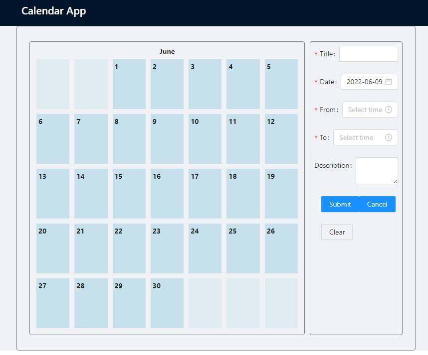

# Calendar testing App

This project was bootstrapped with [Create React App](https://github.com/facebook/create-react-app).

## How to run application

### `npm install`
All required modules will be loaded.

### `npm start`

Runs the app in the development mode.\
Open [http://localhost:3000](http://localhost:3000) to view it in the browser.

## App overview
Components:
 * Calendar
    - Could be used without form to showcase (for ex)
 * Event form
___

### Stage1

Initial calendar state without any events or selections.
___

After clicking on any date - sidebar will pop up with event form
___

After filling and submitting the form, the new event will be visible on the calendar.
___

After clicking on any event - sidebar will pop up with event date in **readonly** mode